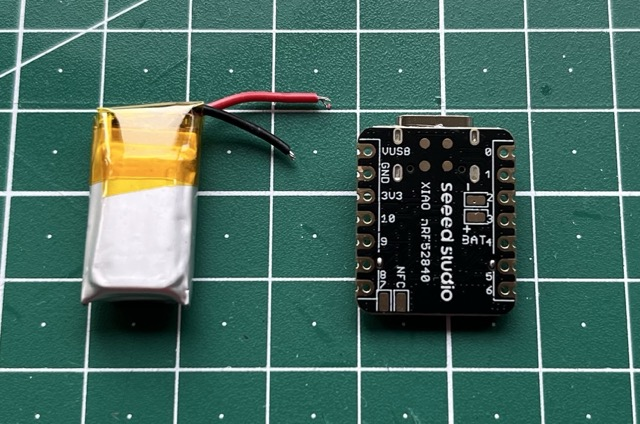

# PomodoroRing

## Overview
This Repository features a project of a smart ring the "PomodoroRing". It is a fully functional smart ring with gesture recognition to control a pomodoro timer.

---

## Materials

### Hardware
- DC-Vibrationsmotor, 3V, 80mA, 10000rpm ([Reichelt](https://www.reichelt.de/de/de/shop/produkt/dc-vibrationsmotor_3v_80ma_10000rpm-330524))
- Li-Ion Akku, SOLDERED 333276, 100 mAh, 3,7 V ([Reichelt](https://www.reichelt.de/de/de/shop/produkt/li-ion_akku_soldered_333276_100_mah_3_7_v-373540))
- Xiao nRF52840 Sense, BT5.0, without Header ([Reichelt](https://www.reichelt.de/de/de/shop/produkt/xiao_nrf52840_sense_bt5_0_ohne_header-358358?r=1&PROVID=2788&gad_source=1&gad_campaignid=337558350&gbraid=0AAAAADwnxtYYT2kwIgnUo1cXem0fqvaFJ&gclid=Cj0KCQjwm93DBhD_ARIsADR_DjEvaGFkB_UFZhn1B40u8ca1vh3ktZ8v9nuKH8JjeoThX2sUdx0t8vsaAtW1EALw_wcB))
- Bipolartransistor, NPN, 45V, 6A, 36W, TO-126 ([Reichelt](https://www.reichelt.de/de/de/shop/produkt/bipolartransistor_npn_45v_6a_36w_to-126-216555))

### Tools
- Soldering Iron
- 3D-Printer

### Software / Libraries
- Arduino IDE
  - Look here to see how to get the Xiao nRF52840 Sense running with Arduino IDE: [Doku](https://wiki.seeedstudio.com/XIAO_BLE/)
- Seeed Arduino LSM6DS3[Look here](https://github.com/Seeed-Studio/Seeed_Arduino_LSM6DS3/)
---

## Assembly

### Step 1: [Preparation]
- For the start take the battery and the Xiao nRF52840 Sense. 
- For the next steps you need the soldering iron.
- Cut the cables of the battery to the correct length.

---

### Step 2: [Connect the Battery]
- Solder the battery to the back of the microcontroller.
  - Black: -
  - Red: +

---

### Step 3: [Preparation of Vibration-motor]
- Solder the blue cable of the vibration-motor to the middle pin of the transistor.

---

### Step 4: [Attach the Vibration-motor]
- Attach the vibration-motor to the back of the microcontroller with the tape of the back of the motor.
- Solder the Red wire to the 3.3V pin.

---

### Step 5: [Attach the Transistor]
- Solder left pin of the transistor to pin 2.
- Connect the right pin to the ground (GND) of the microcontroller. (You can use a small cable to make it easier)

#### Your microcontroller should look like this:

---

### Step 5: [Casing]
- Print the 3D-Case found [here](case/).
- Slide the ring into the case.

---

## Implementation

This project consists four scripts.

1. MLDataAcquisition: This is needed for the data acquisition for Edge Impulse
2. MLClassifier: This is to validate the model with the ring.
3. PomodoroRingBLE: This has the complete pomodoro concept implemented and can be operated over BLE, but does not have gesture detection.
4. PomodoroRing: This is the main project. It combines the pomodoro concept with gesture detection to control it.

### Edge Impulse

You have to create a [Edge Impulse](https://edgeimpulse.com) account and create a project to train your own ML-Model.
A detailed description how to connect your Xiao nRF52840 Sense with Edge Impulse and train a ML-Model can be found [here](https://wiki.seeedstudio.com/XIAOEI/).

## Credits
This project was developed by:
- Torben Zwinge
- Jonas Niggemann
- Joel Neumann